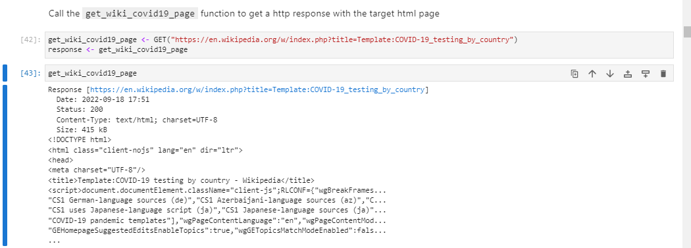
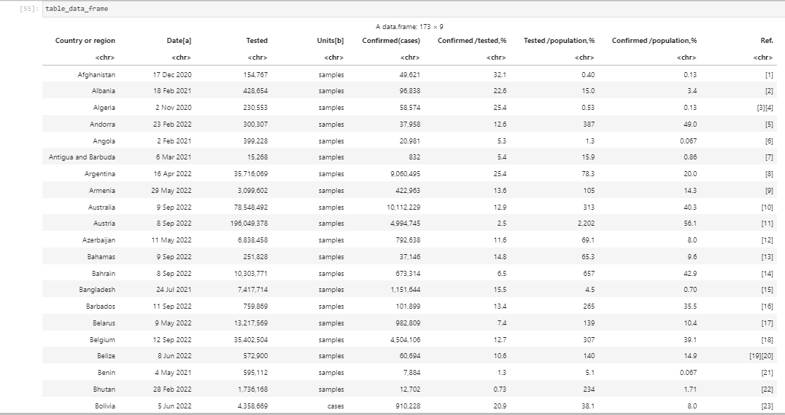
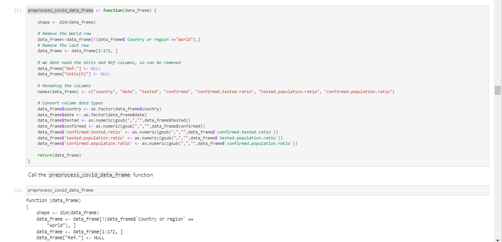
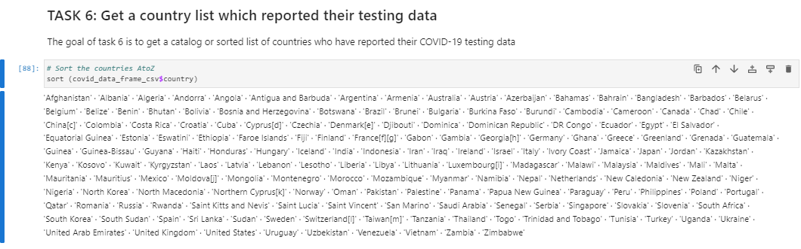
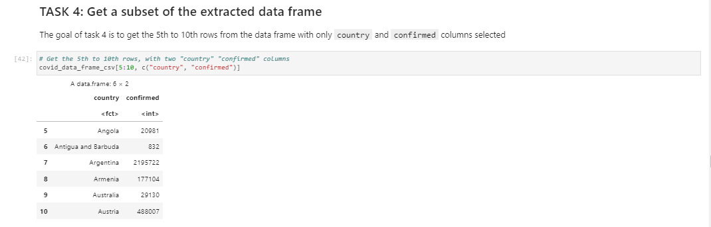
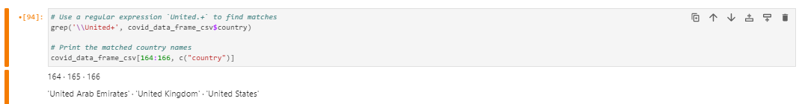
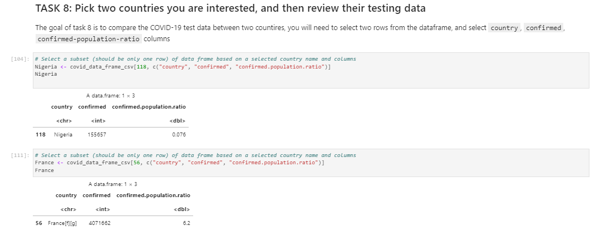
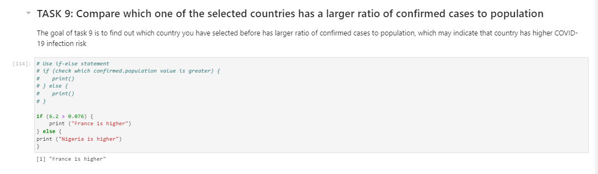
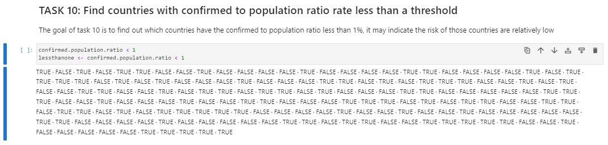

## COVID-19-WORLD-FIGURES
This is an analysis of COVID-19 confirmed cases from around the world, using a dataset extracted from Wikipedia and the R (Posit) language. 
# WHAT DID COVID-19 DO TO THE WORLD?

## Introduction 
This is my analysis of COVID-19 impact, from the year 2021-2022. It features figures from different countries, obtained by extracting the HTML page from Wikipedia, using the R programming language.

## Problem Statement 
This project aims to provide insight into the widespread impact of the pandemic on various countries. 

## Skills Demonstrated
Cleaning of data with R.
Converting of data column types.
Extracting a subset of the data frame.
Converting HTML files into tables.
Calling webpages to get HTTP response with the target HTML page.

## Data Sources 
The dataset used for analysis was an HTML file obtained from Wikipedia using the get function, as shown below:

## Data Transformation
- First, I separated the data into a table of 173 rows and 9 columns using the comma as a delimiter. 

- Then I proceeded to clean the data, removing unnecessary rows and columns. The units and ref columns were removed because they showed the amounts and reference numbers for the samples taken, and they were not necessary for this specific analysis. They would be more relevant to health professionals in the country who want to track down sample(s) for further lab analysis. Data types for some columns were converted, so that they would present the data in the correct format.

- The data was then sorted alphabetically.

## Analysis 
- I extracted specific rows with only the “country” and “confirmed” columns, showing.

- I used a regular expression to find states with the matching name “United”.

- I reviewed testing data for Nigeria and France. I was particularly interested in the confirmed cases vis-a-vis the confirmed population ratio. This is because news channels had been reporting that Nigeria, in comparison with the West, had lower confirmed Covid cases. I wanted to get data that would confirm this. 

- I used an “if-else” statement to get which country, from the 2 selected earlier, has a higher ratio of confirmed cases to the general population.

- Lastly, I used a threshold of 1% to find which countries had a lower risk of Covid-19.

## Conclusion and Recommendations 
	
   Covid-19 changed the way we live our lives, by looking at datasets from the pandemic period, we can see which countries have a high risk of infections from the period. This information will allow us to better prepare for such situations in the future. 
   Should such situations break out again, these countries should be immediately quarantined, to avoid further exposure. Higher measures to be imposed will be known when samples of the outbreak are taken. If they present similar to Covid-19 samples, then the countries with high figures from this dataset should be locked down. 
  The genetic makeup of citizens from these countries with high confirmed population figures can be examined further to see what peculiarities made them susceptible to Covid-19. This will enable them to know what exactly to target, in terms of treatment for such similar diseases in the future.  

  # THANK YOU!

  
